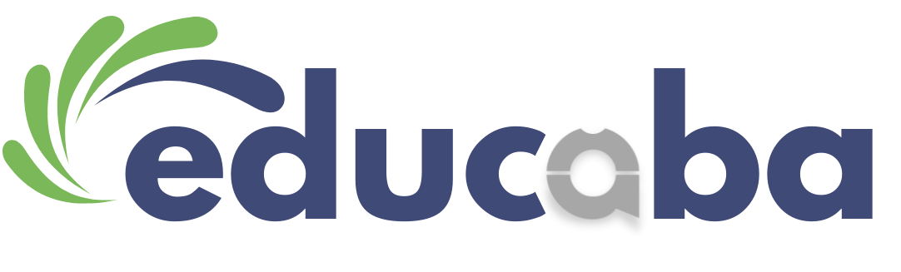

## Gerenciador ABA

A clinica realiza tratamento com crianças autistas e este software é desenvolvido com o propósito de auxiliar nas execuções das tarefas diárias.

## Projeto

Este projeto contém o backend da aplicação, sendo uma API para comunicação com aplicações clientes, neste caso mobile e web, contidos em outro [repositório](https://github.com/Matheusmdr/educaba).

## Funcionalidades

O objetivo da aplicação é gerenciar os tratamentos, tendo então pouca ênfase na parte adminstrativa de uma clínica. O foco é no gerenciamento de pacientes e programas que estes realizam; registro de atividades realizadas; progresso de determinado programa e fornecimento de dados para plotagem de gráfico com a evolução do tratamento.
